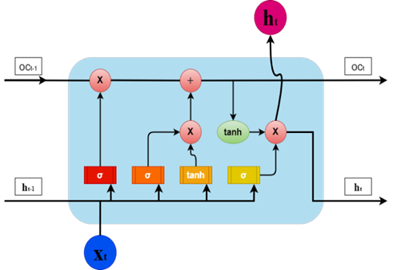
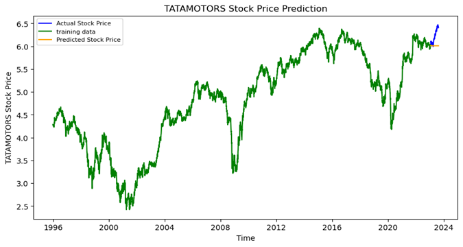

# Share-market-prediction-using-LSTM-and-ARIMA-models.

This repository contains the complete implementation of the **hybrid stock market prediction framework** proposed in the research paper:

> **Synergizing Fundamental and Technical Analysis for Enhanced Prediction of Indian Stock Market Stocks**
> *Nandakumar R, Sameer Sayyad, Satish Kumar, Arunkumar Bonagle*

The project is designed specifically for the **Indian stock market**, which is highly volatile and influenced by macroeconomic indicators, technical price movements, and market sentiment. By combining **Fundamental Analysis**, **Technical Analysis**, and **Deep Learning (LSTM)**, this framework improves prediction accuracy and decision-making confidence.

---

## 📂 Repository Structure

```
├── codes/
│   ├── fundamental_analysis.py        # Fundamental & sentiment analysis
│   ├── technical_analysis_part1.py    # Technical indicators & preprocessing
│   └── technical_analysis_part2.py    # LSTM-based price prediction
│
├── figures/
│   ├── lstm_architecture.png
│   ├── tcs_prediction.png
│   ├── adanient_prediction.png
│   └── tatamotors_prediction.png
|
│
└── README.md
```

---

## 🔍 Methodology Overview

The proposed framework follows a **sequential and modular pipeline**:

1. **Fundamental Analysis** – evaluates company health and market sentiment
2. **Technical Analysis** – captures price trends and momentum using indicators
3. **Deep Learning Prediction** – forecasts future stock prices using LSTM

This layered approach ensures that both **qualitative** and **quantitative** aspects of the market are considered.

---

## 🧾 Fundamental Analysis Module

**File:** `codes/fundamental_analysis.py`

This module focuses on understanding the intrinsic value of stocks and the impact of public sentiment.

### Key Features

* Company-level financial parameter analysis
* News-based **sentiment analysis**
* Filtering of stocks before technical modeling

Fundamental analysis helps reduce noise by eliminating fundamentally weak stocks before applying time-series models.

---

## 📊 Technical Analysis – Part 1

**File:** `codes/technical_analysis_part1.py`

This stage extracts meaningful numerical patterns from historical stock price data.

### Techniques Used

* Moving Averages (SMA, EMA)
* Relative Strength Index (RSI)
* MACD and trend-based indicators
* Data normalization and windowing

These indicators act as **feature inputs** for the deep learning model.

---

## 🤖 Technical Analysis – Part 2 (Deep Learning)

**File:** `codes/technical_analysis_part2.py`

This module implements an **LSTM (Long Short-Term Memory)** neural network to predict future stock prices based on historical trends.

### LSTM Architecture



*Figure 6: Architecture and layers of the proposed LSTM model highlighting gating mechanisms and information flow.*

LSTM is chosen due to its ability to retain long-term dependencies in volatile time-series stock data.

---

## 📈 Results and Predictions

The framework was evaluated on multiple Indian stocks, demonstrating strong trend-following capability and reduced prediction error.

### TCS Stock Prediction


*Figure 8: TCS stock trend prediction using the proposed hybrid framework.*

---

### ADANIENT Stock Prediction


*Figure 9: ADANIENT stock trend prediction results.*

---

### TATAMOTORS Stock Prediction



*Figure 10: TATAMOTORS stock trend prediction results.*

---

## ✅ Key Outcomes

* Improved prediction accuracy compared to standalone models
* Better robustness in highly volatile market conditions
* Effective integration of sentiment, indicators, and deep learning

The results validate that **hybrid modeling significantly enhances stock market prediction performance** in the Indian equity market.

---

## 🚀 Future Scope

* Integration of real-time data streams
* Transformer-based time-series models
* Portfolio-level optimization and risk analysis

---

## 📜 Citation

If you use this work in your research, please cite the original paper:

```
Synergizing Fundamental and Technical Analysis for Enhanced Prediction of Indian Stock Market Stocks
```

---

## 🤝 Contributing

Contributions, issues, and feature requests are welcome. Feel free to fork the repository and submit pull requests.

---

## 📧 Contact

For questions or collaboration, please reach out to the authors via the research publication.
